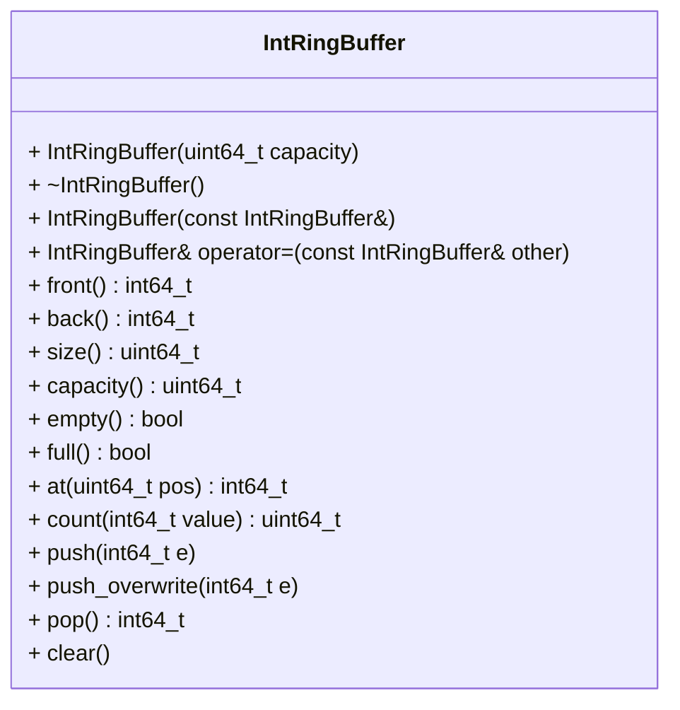

# Ring Buffer for Integers (`int64_t`)

A ring buffer (also called circular buffer) for storing integers is to be
created. A ring buffer is a queue (first in, first out) with a fixed capacity
that is set once in the constructor. The elements must be stored in a single
dynamic array that is allocated in the constructor and never resized. When
the end of the array is reached, the buffer continues at the beginning of the
array (wrap-around). Therefore, no elements have to be moved when adding or
removing elements and all central operations must be implemented in $O(1)$
time complexity. Using containers of the standard library (e.g.
`std::vector` or `std::deque`) for storing the elements is not allowed.

This repository contains a `CMakeLists.txt` file that is already sufficient
for the project. It also contains some automated tests that provide feedback
on your progress. To receive full points, the following API must be declared
in `int_ring_buffer.hpp`. Its implementation must be realized in
`int_ring_buffer.cpp`. You have to correctly declare the member functions'
`const`-ness in order to allow the provided auto-tests to compile. Place all
your declarations and definitions inside the appropriate namespace (the
namespace name must match the namespace used in the provided test cases).

After finishing the below tasks, run the following commands to see if your code
is correct. Note that a current version of `libcatch` has to be installed
to compile.

```shell
mkdir build && cd build
cmake ..
make -j4
./int_ring_buffer_test
```

The following class diagram gives an overview of the required API.



In addition to the class, implement the following operator as non-member.

```cpp
std::ostream& operator<<(std::ostream& os, const ds::IntRingBuffer& rb);
```

## Wrap-around
The following example shows a ring buffer with capacity `4` after the calls
`push(1)`, `push(2)`, `push(3)`, `pop()`, `pop()`, `push(4)` and `push(5)`.
As the end of the array was reached, `5` has been stored at index `0`.
Nevertheless, `front()` returns `3`, `back()` returns `5` and the positions
used by `at(.)` are `at(0) == 3`, `at(1) == 4` and `at(2) == 5`.

```text
index      0     1     2     3
         +-----+-----+-----+-----+
array    |  5  |     |  3  |  4  |
         +-----+-----+-----+-----+
            ^           ^
           back       front
```

The array index of the element at position `pos` can be calculated with the
modulo operator `%`.

## Required behavior
`IntRingBuffer(uint64_t capacity)` create an empty buffer that can store up
  to `capacity` elements; throw an exception if `capacity` is `0`  
`~IntRingBuffer()` free all heap-allocated resources  
`IntRingBuffer(const IntRingBuffer&)` create an independent copy with the
  same capacity and the same elements in the same order  
`IntRingBuffer& operator=(const IntRingBuffer& other)` replace the content
  (and the capacity) with an independent copy of `other`; self-assignment
  (`rb = rb`) must leave the buffer unchanged  

`int64_t front()` return the oldest element (the one `pop()` would remove)  
`int64_t back()` return the newest element  
`uint64_t size()` return the number of stored elements  
`uint64_t capacity()` return the maximum number of elements  
`bool empty()` return `true` if the buffer is empty, `false` otherwise  
`bool full()` return `true` if the buffer is full, `false` otherwise  
`int64_t at(uint64_t pos)` return the element at position `pos`, where
  position `0` is the oldest and position `size() - 1` the newest element  

`uint64_t count(int64_t value)` return the number of occurrences of
  `value` in the buffer  

`void push(int64_t e)` add `e` as newest element; throw an exception if the
  buffer is full  
`void push_overwrite(int64_t e)` add `e` as newest element; if the buffer is
  full, the oldest element is removed (overwritten) instead of throwing  
`int64_t pop()` remove and return the oldest element  
`void clear()` remove all elements; the capacity stays the same  

`front()`, `back()` and `pop()` must throw an exception (e.g.
`std::out_of_range`) if the buffer is empty. `at(pos)` must throw if `pos` is
out of bounds.

`std::ostream& operator<<(std::ostream& os, const IntRingBuffer& rb)` print
all elements from the oldest to the newest, e.g. `rb[3, 4, 5]`; an empty
buffer is printed as `rb[]`

The implementation of the ring buffer may, of course, use additional private 
member functions.


# Grading
This task will primarily be graded using autotests. You also need
to maintain a consistent coding style. In particular, all identifiers and
comments have to be in English!
